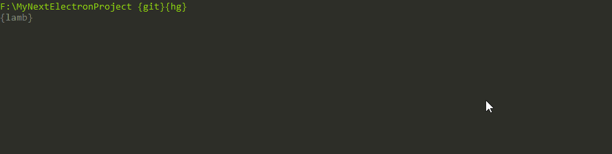

<br />
<div align="center"><strong>Keep your favorite starter kits just a command away</strong></div>
<p></p>
<p align="center">
  <a href="https://travis-ci.org/Raathigesh/Propel">
    
  </a>
  <a href="https://github.com/Raathigesh/Propel/blob/master/LICENSE">
    
  </a>
  <a href="https://www.npmjs.com/package/propel">
    
  </a>
</p>

## Why?
Certain starter kits I use again and again. But it's always a hassel to keep them bookmarked, to find them when required and then clone to a directory.

**Propel** will remember them and clone to the desired directory for you with a single command. But propel is all about remembering a git repo and cloning it to a directory. Use it for anything you like.

## Installation
```
$ npm install Propel -g
```

## Usage


Clone a starter kit to the **current working directory**
```
propel
```


Add a new starter kit
```
propel -a
```

Remove a start kit
```
propel -r
```

Export the current starter kits to a JSON file
```
propel -e
```

Import the starter kits from an exported JSON file **from the current working directory**
```
propel -i StaterKit.Json
```

## License
MIT © [Raathigeshan](https://twitter.com/Raathigeshan)
